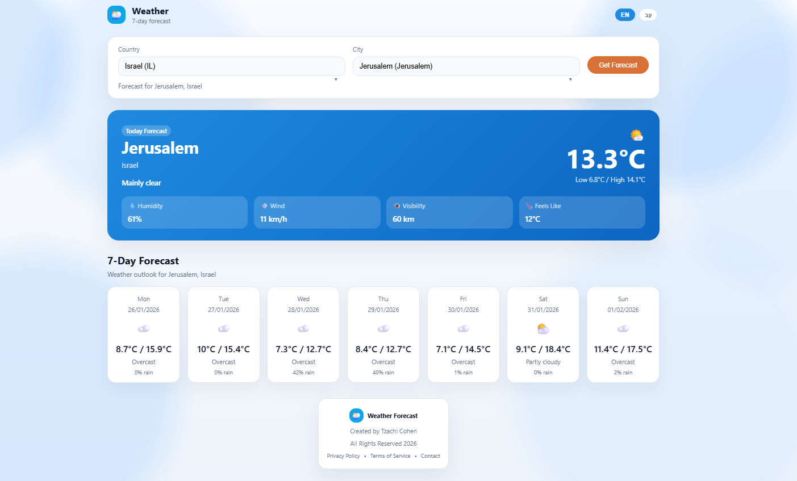

# weather-forcast

Weather forecast per country and city for the coming days.

## Overview
- MCP server in TypeScript with U.S. NWS data and Open-Meteo fallback
- Web app with searchable country/city dropdowns and weekly forecast
- Hebrew/English UI toggle with RTL support

## UI functionality
- Auto-populates your location when permissions are granted
- Mobile-first responsive layout and touch-friendly controls
- Language switcher with persisted preference and RTL support
- Current conditions, hourly highlights, and multi-day outlook

## Live app
Running on Vercel: https://weather-forcast-boni.vercel.app/

## Quick start
```bash
npm install
npm run build
npm run web
```

Open `http://localhost:3000`.

## MCP server usage
Run the MCP server (stdio):
```bash
node build/index.js
```

Example tool call (JSON-RPC):
```json
{"jsonrpc":"2.0","id":1,"method":"tools/call","params":{"name":"get-forecast","arguments":{"latitude":32.0853,"longitude":34.7818}}}
```

## Screenshots
Live preview:


